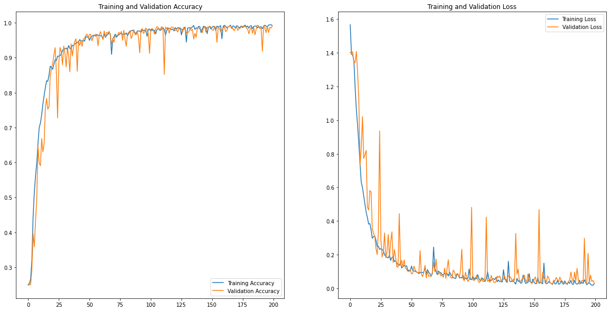
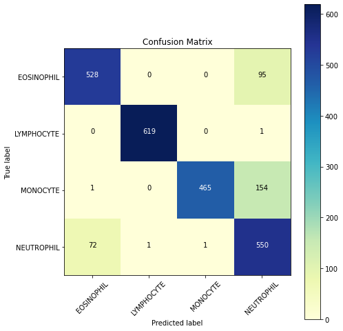

# Blood Cell Classifier
Tensorflow and Keras-based CNN classifier that separates out different types of white blood cells using images. 

Dataset obtained from [Kaggle](https://www.kaggle.com/paultimothymooney/blood-cells). Accuracy: **87%**.

### Model Architecture:

